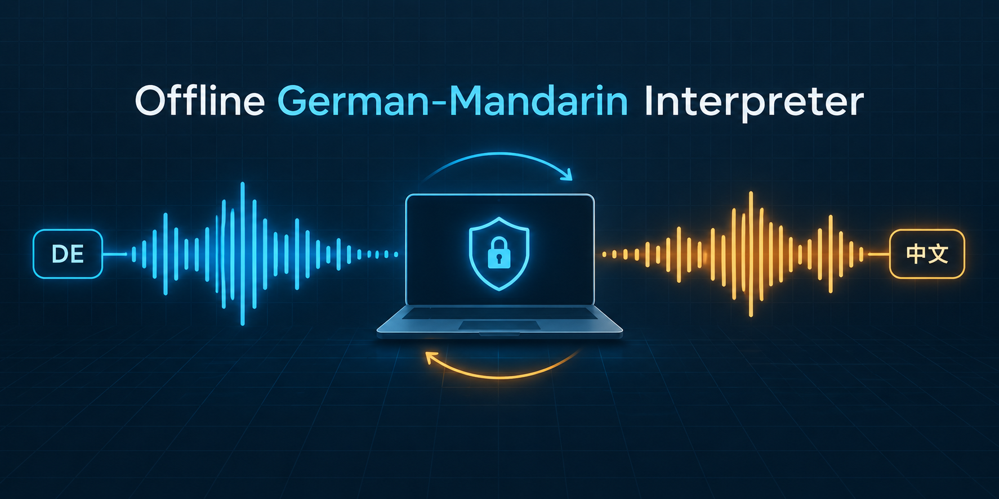

# Offline German-Mandarin Interpreter



[](https://github.com/boris-heuer/offline-german-mandarin-interpreter/actions/workflows/ci.yml)
[](https://github.com/boris-heuer/offline-german-mandarin-interpreter/actions/workflows/codeql.yml)
[](LICENSE)

A Windows desktop prototype for private, **near-real-time, utterance-based** conversations between
German and Mandarin Chinese. Audio is segmented at pauses, then transcribed, translated, and spoken;
it is not a simultaneous or word-by-word interpreter. Runtime audio processing and model inference
are local after the one-time model download.

> **Prototype status.** Results depend on language, noise, speakers, and hardware. Verify important
> conversations independently. The experimental Call Bridge is disabled by default and must not be
> used for calls until its hardware and call-application acceptance gates are complete.

The image above is the repository social-preview asset; it is an abstract illustration, not an
application screenshot or a performance claim.

## Reference system and portability

The defaults were developed on this reference system:

- AMD Ryzen AI 7 350, 8 cores / 16 threads
- 64 GB RAM
- AMD Radeon 860M without CUDA support
- Windows 11 Pro and Python 3.12

Faster-Whisper `small` uses CTranslate2 CPU INT8 and MarianMT uses CPU worker threads. The Radeon
is not assumed to provide CUDA. This is a reference configuration, not a hardware requirement:
use the device selectors and measure the actual latency on your system with `scripts/benchmark.py`.

The default `auto` device setting selects CUDA independently for CTranslate2, PyTorch, and ONNX
Runtime when each backend reports a usable NVIDIA GPU. Any unavailable backend falls back to the
CPU, so a partial or missing CUDA installation does not prevent the application from starting.

## Architecture

```text
Microphone (16 kHz mono)
  -> energy-based speech and pause detection
  -> bounded real-time queue
  -> Faster-Whisper small (CPU INT8)
  -> MarianMT de <-> zh
  -> Piper TTS
  -> selected speakers
```

Microphone processing is muted while Piper speaks, preventing the application from translating
its own output. If the bounded queue fills, the oldest pending segment is dropped to prevent the
conversation from accumulating increasing delay.

Automatic mode detects and routes every completed utterance independently. It never assumes that
participants alternate, so any number of German or Mandarin turns may occur consecutively. See
[`docs/conversation-architecture.md`](docs/conversation-architecture.md) for multi-participant
scenarios, overlap limitations, and the TDD strategy.

## Experimental Call Bridge

The disabled-by-default Call Bridge places the application between a local headset and a call
application that permits explicit microphone and speaker selection, such as WeChat. Two independent,
fixed-direction translation lanes connect the
physical headset to two virtual audio cables without exposing the physical microphone directly to
the call application.

- [`docs/call-bridge-architecture.md`](docs/call-bridge-architecture.md) defines the technical
  architecture and audio routing decisions.
- [`docs/call-bridge-implementation-plan.md`](docs/call-bridge-implementation-plan.md) contains the
  risk assessment, TDD work order, scenarios, and acceptance gates.
- [`docs/call-bridge-system-ok.md`](docs/call-bridge-system-ok.md) records automated evidence and
  the remaining packaged-device/real-call production gates.
- [`docs/call-bridge-operator-setup.md`](docs/call-bridge-operator-setup.md) defines the Windows and
  WeChat device mapping.

The application persists native Windows MMDevice identities and resolves the current WASAPI index
at runtime. Missing or ambiguous devices mute the affected lane; they never fall back to a Windows
default endpoint. This command is a local model check, not proof of safe hardware routing or a
working WeChat call:

```powershell
.\.venv\Scripts\python.exe .\scripts\call_bridge_self_test.py
```

## Windows installation

Run in PowerShell from the project directory:

```powershell
Set-ExecutionPolicy -Scope Process Bypass
.\scripts\setup.ps1
```

The script:

1. creates a Python 3.12 virtual environment in `.venv`,
2. installs the hash-locked Windows dependencies and the application,
3. downloads Faster-Whisper, both MarianMT models, and the German Piper voice,
4. validates the installation with the offline doctor.

Model download is the only setup step that requires internet access. Existing downloads are reused
from the Hugging Face cache. Spoken output is disabled by default because Mandarin speech output is
not preconfigured. Provide a Piper-compatible,
license-reviewed Mandarin `.onnx` voice file and its matching `.onnx.json` metadata file, then set
`tts.zh_voice_path` (the intended default location is
`models/piper/zh_CN-user-provided.onnx`). To validate an existing installation without requesting
models:

```powershell
.\.venv\Scripts\python.exe .\scripts\doctor.py
```

## Run

```powershell
.\.venv\Scripts\python.exe -m offline_translator
```

- `F8`: start capture
- `F9`: stop capture
- Choose automatic direction, German to Mandarin, or Mandarin to German.
- Select microphone and speakers before starting.
- Disable or enable spoken output at any time.

Models are loaded into memory when first needed, so the first request is slower than subsequent
requests.

## Measure latency

Use your own 16 kHz mono PCM16 WAV files with spoken test sentences:

```powershell
.\.venv\Scripts\python.exe .\scripts\benchmark.py C:\path\german.wav --mode de-zh
.\.venv\Scripts\python.exe .\scripts\benchmark.py C:\path\mandarin.wav --mode zh-de
```

The benchmark returns exit code `0` when end-to-end processing, including voice output, takes no
more than three seconds. Use `--without-tts` to measure STT and translation only.

After provisioning both reviewed voice models, run the fully offline synthetic self-test to exercise
both language directions through real STT, translation, and TTS models without requiring a person
to speak:

```powershell
.\.venv\Scripts\python.exe .\scripts\self_test.py
.\.venv\Scripts\python.exe .\scripts\ui_self_test.py
```

The UI self-test opens the real application window, starts the microphone, injects deterministic
speech, renders the result, plays the translated voice, and closes after a successful turn.

## Configuration and glossary

[`config/settings.json`](config/settings.json) contains safe repository defaults for audio
thresholds, model paths, and thread counts. Runtime selections, including private Windows endpoint
IDs, are saved to the ignored `config/settings.local.json` overlay. Define domain terminology in
[`config/glossary.json`](config/glossary.json):

```json
{
  "de-zh": {
    "Ryzen AI": "锐龙 AI"
  },
  "zh-de": {
    "人工智能": "artificial intelligence"
  }
}
```

Longer glossary terms are replaced before shorter ones. The pipeline retains the last five
conversation entries. MarianMT translates the current sentence only for predictable latency and
quality; the context interface allows a later context-aware engine without changing capture or UI
code.

## Test and quality checks

```powershell
.\.venv\Scripts\python.exe -m pytest
.\.venv\Scripts\python.exe -m ruff check .
```

Most automated tests use deterministic fakes and do not require a microphone, virtual cables, or
WeChat. See the [engineering case study](docs/engineering-case-study.md) for the evidence ladder
and the gates that still require a human operator. The phased publication evidence is tracked in
the [publication-readiness checklists](docs/publication-readiness-checklists.md).

## Windows build

```powershell
.\scripts\build.ps1
```

The result is written to `dist\OfflineInterpreter`. By default this is a thin build containing the
application and configuration but no model weights. After reviewing every local model license, an
operator may explicitly create a local model-inclusive build with `scripts\build.ps1 -IncludeModels`.
Do not redistribute that output unless the corresponding model notices and source obligations are
satisfied. A directory build is used intentionally because it starts faster and handles large model
files more predictably than a single executable.

## Privacy and diagnostics

- Runtime code makes no network requests; all model loaders use local paths only.
- Transcript export happens only after the user chooses a local destination.
- Rotating logs are stored in `logs\offline-interpreter.log` and never contain audio.
- Native faults are written to `logs\native-crash.log`; Qt uses software rendering for stability
  on the integrated Radeon GPU.
- Missing dependencies and models produce actionable error messages.
- `scripts\doctor.py` validates dependencies and every required model file.
- `scripts\self_test.py` validates both complete model pipelines against the three-second target.

## Model sources and licensing

- Speech recognition: `Systran/faster-whisper-small`
- Translation: `Helsinki-NLP/opus-mt-de-zh` and `Helsinki-NLP/opus-mt-zh-de`
- German voice: `rhasspy/piper-voices`, `de_DE-thorsten-medium`
- Mandarin voice: supplied separately by the user as a Piper-compatible ONNX model with matching
  metadata; the user is responsible for confirming its license and distribution terms

Review and redistribute all applicable package and model licenses with any binary distribution.
Review the license for the exact Piper runtime and voice artifacts selected for distribution.

## Contributing and support

- [Contributing guide](CONTRIBUTING.md)
- [Security reporting](SECURITY.md)
- [Support boundaries](SUPPORT.md)
- [Roadmap](ROADMAP.md) and [changelog](CHANGELOG.md)
- [AI-assisted development disclosure](AI_ASSISTED_DEVELOPMENT.md)
- [Citation metadata](CITATION.cff)

Maintained by [Boris Heuer](https://github.com/boris-heuer). Contributions and evidence-led
technical review are welcome.
