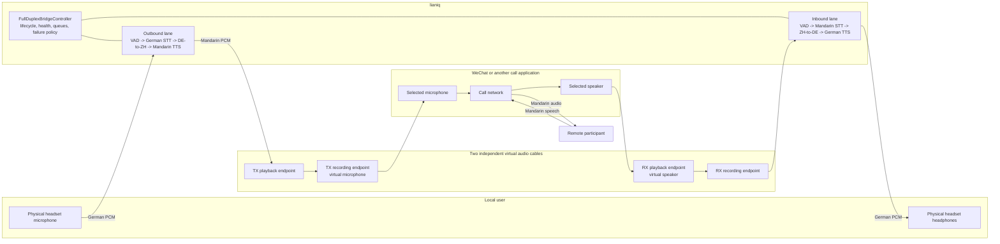

# Call Bridge Architecture

## Status

Implemented as an experimental feature. Source-level and deterministic test gates are complete;
packaged hardware routing and a real two-party call must still pass before production SystemOK.
This document describes the implemented architecture for connecting `lianiq` to a
desktop call application such as WeChat.

## Objective

Place the interpreter between a local headset and a call application so that:

- local German speech reaches the remote participant as Mandarin audio;
- remote Mandarin speech reaches the local user as German audio;
- audio remains local except for the synthesized target-language stream sent through the call;
- consecutive turns in the same language work without assuming speaker alternation; and
- the two directions remain isolated and cannot create a digital feedback loop.

## Architecture decision

Keep the feature inside the existing local modular monolith. Add two reusable, unidirectional
`TranslationLane` instances under one `FullDuplexBridgeController`. Do not split model stages into
services and do not build a custom Windows kernel audio driver for the first release.

Use two independent virtual audio cables supplied and installed separately:

1. `TX Cable` carries synthesized Mandarin from the interpreter to the call application's virtual
   microphone.
2. `RX Cable` carries remote Mandarin audio from the call application's virtual speaker to the
   interpreter.

The application must depend only on normal Windows audio endpoint contracts. Product code must
not hard-code a particular virtual-cable vendor or device display name.

## Compatibility boundary

The endpoint abstraction is vendor- and call-application-agnostic, but it does not imply universal
compatibility. The headset must expose safe, unambiguous Windows capture and playback endpoints.
The call application must independently route its microphone to the TX cable and its speaker to the
RX cable. Application, Windows, driver, and headset profiles require separate real-call evidence;
passing one profile does not certify another. See
[`call-bridge-compatibility.md`](call-bridge-compatibility.md) for the public compatibility matrix
and acceptance policy.

## Signal flow



Virtual-cable names are counterintuitive on common Windows drivers: an application writes to the
cable's playback endpoint, while another application reads the paired recording endpoint. The UI
must therefore show both the Windows display name and the semantic role shown above.

## Fixed-direction lanes

Call-bridge routing is more reliable than automatic language routing because the selected endpoint
defines the direction:

| Lane | Capture endpoint | Source | Target | Playback endpoint |
|---|---|---|---|---|
| Outbound | Physical headset microphone | German | Mandarin | TX cable playback endpoint |
| Inbound | RX cable recording endpoint | Mandarin | German | Physical headset headphones |

Speaker identity is not part of routing. Multiple German speakers on the local side still produce
German-to-Mandarin turns. Multiple Mandarin speakers on the remote side still produce
Mandarin-to-German turns.

## Runtime components

```text
lianiq/
  audio/
    endpoints.py              # Stable endpoint identity and enumeration
    capture_stream.py         # Non-blocking endpoint capture adapter
    playback_stream.py        # Explicit endpoint playback adapter
    resampler.py              # Endpoint format to STT format conversion
    ring_buffer.py            # Bounded real-time audio buffer
  call_bridge/
    contracts.py              # Frames, endpoint roles, lane configuration
    translation_lane.py       # One fixed-direction processing lane
    controller.py             # Full-duplex lifecycle and health coordination
    inference_scheduler.py    # Bounded access to shared model resources
    health.py                 # Device loss, underrun, overrun, and latency state
  ui/
    call_bridge_panel.py      # Four endpoint selectors and level/status indicators
tests/
  call_bridge/
    test_translation_lane.py
    test_full_duplex_controller.py
    test_endpoint_recovery.py
    test_call_bridge_scenarios.py
```

These are target paths. Existing modules should be reused where their contracts already fit; files
must not be introduced solely to reproduce code that already exists.

## Core contracts

`AudioEndpointRef` identifies a Windows endpoint by a stable endpoint identifier, data-flow
direction, host API, and display name. Numeric PortAudio indices are runtime details and must not
be persisted because they can change after reboot, driver installation, or Bluetooth reconnect.

`AudioFrame` carries the endpoint role, lane identifier, monotonic timestamp, sequence number,
sample rate, channel count, and PCM samples. Model inference must never run in an audio callback.

`TranslationLane` owns one segmenter, one bounded queue, one fixed source/target language pair,
and one ordered output stream. Each lane preserves its own ordering independently.

`FullDuplexBridgeController` starts and stops both lanes as one session, validates endpoint
assignments, publishes health state, and applies a fail-closed policy when routing becomes unsafe.

## Threading and buffering

Each capture callback copies the smallest possible PCM block into a bounded ring buffer and
returns immediately. VAD, STT, translation, TTS, resampling, and playback run outside the real-time
callback.

The lanes may process concurrently, but model access is controlled by `InferenceScheduler` so that
CPU or GPU saturation cannot starve audio callbacks. Queue age is more important than queue depth:
stale pending utterances are dropped with an explicit status event rather than played minutes late.

## Audio formats

- Open Windows endpoints in WASAPI shared mode for interoperability.
- Prefer each endpoint's supported mix format, normally 48 kHz for call audio.
- Downmix and resample capture audio to 16 kHz mono for speech recognition.
- Convert synthesized output to the selected endpoint format before playback.
- Keep conversion boundaries explicit and covered by deterministic tests.

## State model

```text
STOPPED
  -> VALIDATING_ENDPOINTS
  -> WARMING_MODELS
  -> RUNNING
       -> DEGRADED        # one lane unavailable; unsafe output remains muted
       -> RECONNECTING    # known endpoint disappeared and returned
  -> STOPPING
  -> STOPPED
```

Starting must fail if the same virtual endpoint is assigned to conflicting roles or if either
virtual cable is incomplete. A device-loss event must stop the affected lane and must never fall
back silently to the Windows default microphone or speakers.

## Failure and privacy policy

The default policy is `mute`:

- failed or uncertain translation is not forwarded to the call;
- loss of a configured endpoint does not reroute audio to a default device;
- raw microphone or remote audio is not stored;
- logs contain endpoint roles, timing, queue state, and errors but no transcript or PCM content;
- test tones require an explicit operator action; and
- only synthesized Mandarin is written to the call microphone endpoint.

An optional future `pass_original` mode requires an explicit warning because it changes the
privacy and language guarantees.

## Echo and feedback isolation

Digital isolation is the primary defense:

- outbound TTS is rendered only to the TX virtual cable;
- inbound TTS is rendered only to the physical headset;
- the call application must not receive the physical headset microphone directly; and
- the call application must not render remote audio directly to the physical headset.

Headset acoustic leakage may still reach its microphone. The first release should use a headset,
push-to-talk option, and conservative VAD. Acoustic echo cancellation is a later adapter, not a
substitute for correct endpoint routing.

## Latency model

The first release remains utterance-based. The target is translated playback within three seconds
after end-of-speech under the supported hardware profile. The latency budget is measured per lane:

```text
endpoint buffering + VAD endpointing + STT + translation + TTS + output buffering
```

Streaming STT, stable-prefix translation, and chunked TTS are a later optimization. They require
revision and cancellation semantics and must not be mixed into the first call-bridge milestone.

## Alternatives

### WASAPI process loopback for inbound audio

Windows can capture the audio rendered by a specific process tree. This could replace the RX
virtual cable but requires a native Windows adapter and reliable identification of the current call
process. Retain it as a later optimization after the two-cable design is proven.

### Custom virtual audio driver

Rejected for the first release. A custom driver adds kernel development, driver signing,
installation, update, and compatibility obligations without validating the translation workflow.

### Audio mixer application

An external mixer can implement the routing but adds operator state and makes support harder. Two
plain cables and explicit application endpoints are easier to test and document.

## External dependencies

- Virtual audio drivers are installed separately by the operator.
- Redistribution or bundling requires an explicit license review.
- The interpreter must continue to operate with any compatible Windows virtual audio device.

Primary references:

- [Microsoft WASAPI overview](https://learn.microsoft.com/windows/win32/coreaudio/wasapi)
- [Microsoft WASAPI loopback recording](https://learn.microsoft.com/windows/win32/coreaudio/loopback-recording)
- [Microsoft application loopback sample](https://learn.microsoft.com/samples/microsoft/windows-classic-samples/applicationloopbackaudio-sample/)
- [VB-Audio virtual cable documentation](https://vb-audio.com/Cable/)
- [Microsoft Bluetooth LE Audio guidance](https://support.microsoft.com/windows/hardware/bluetooth/configuring-bluetooth-le-audio-quality-settings-on-windows-11)
