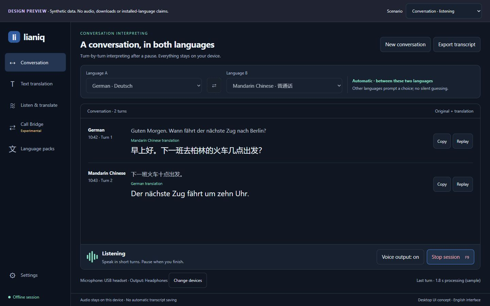
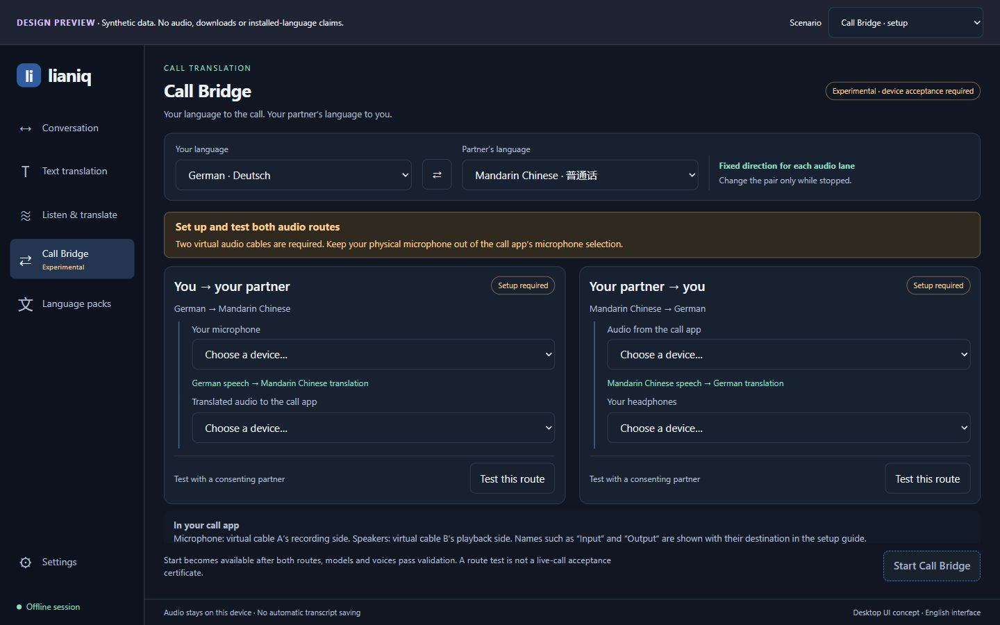
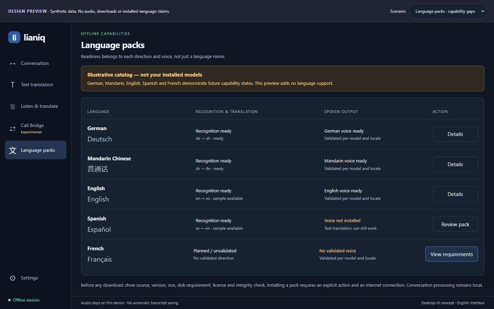
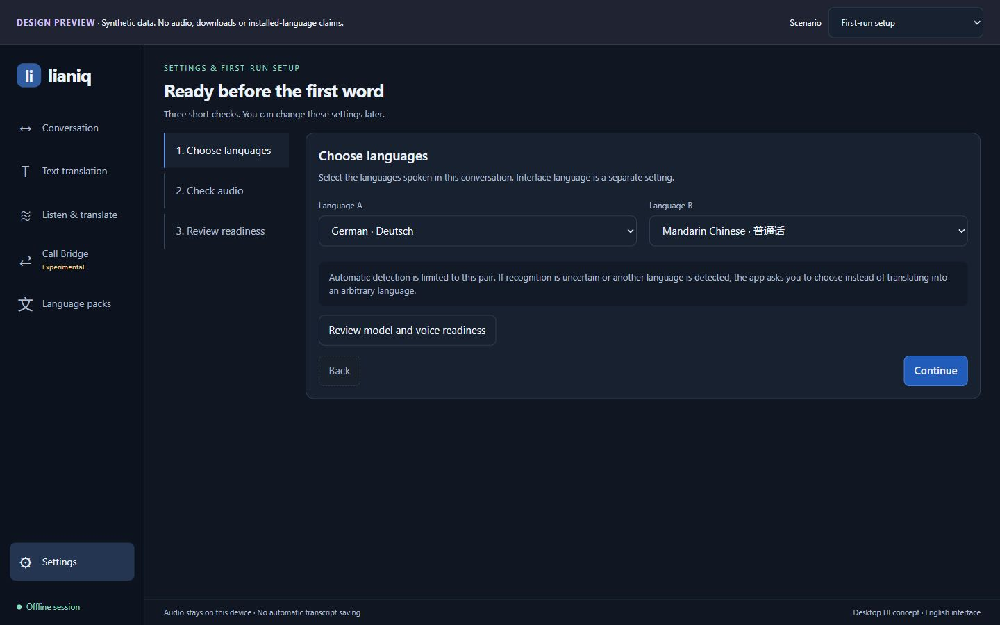
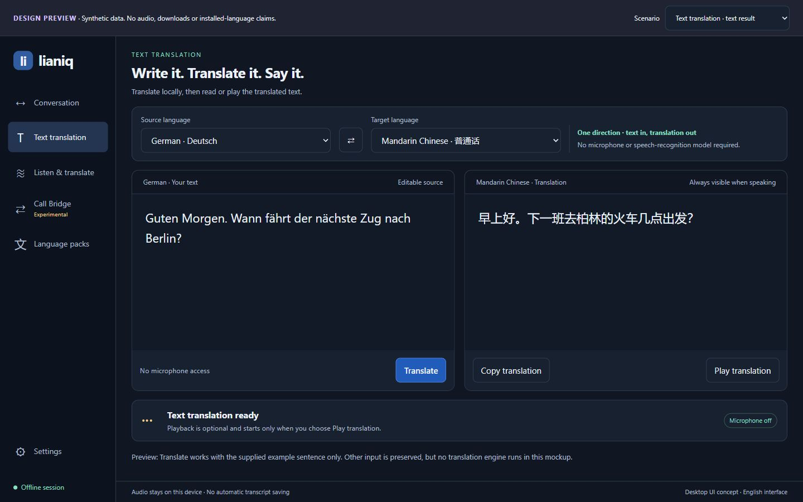
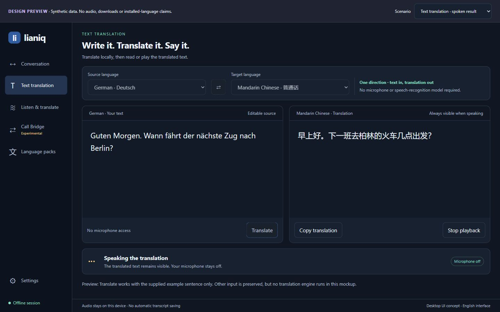
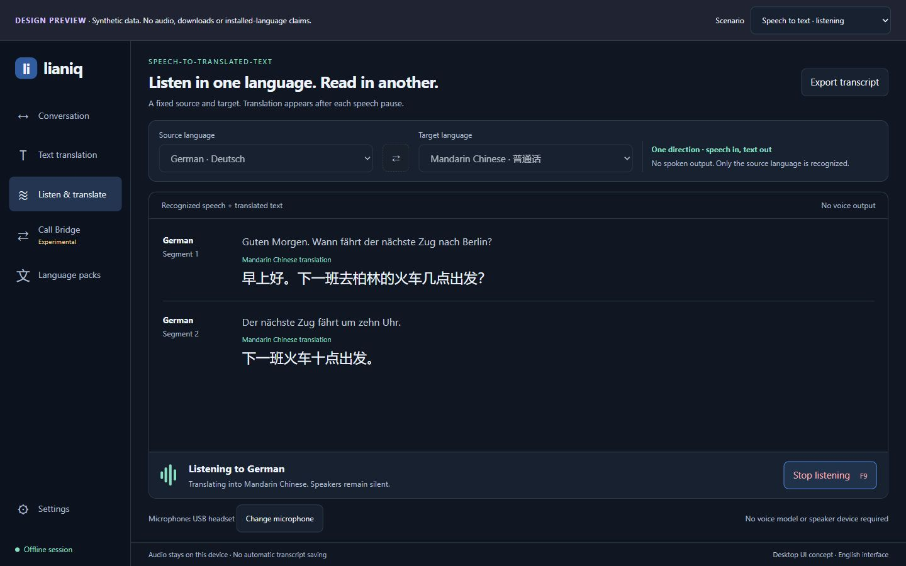

# Target UI gallery

Draft mockups, not screenshots of implemented functionality. All devices, transcripts,
capabilities and timing values are synthetic. The interface stays English; selected
conversation languages are independent.

## Conversation

Paired turns, a large reading area and an explicit microphone state.

## Call Bridge

Separate setup for outgoing and incoming translation. Start remains unavailable until the
required checks pass. The bridge stays experimental.

## Language packs

Recognition, directed translation and voice readiness are separate. Future language
examples do not claim current support.

## First run

Choose languages, check audio and review readiness before starting.

## Recovery and playback

- [Speaking with microphone paused](screenshots/speaking.jpg)
- [Microphone disconnected](screenshots/device-lost.jpg)
- [Incoming Call Bridge lane muted](screenshots/call-bridge-muted.jpg)

Open [the interactive preview](index.html) locally to change scenarios and language pairs.
See the [design contract](README.md) and [implementation backlog](issue-index.md).

## Text translation

Typed source and translated text share one workspace. Optional Play translation uses
the target voice; the translation remains visible throughout playback. No microphone
or recognition model is required.

## Listen and translate

Speech from one fixed source language is translated into text in the target language.
No speech is played and no target voice is required. Opening the workspace keeps the
microphone off until Start listening is pressed.

